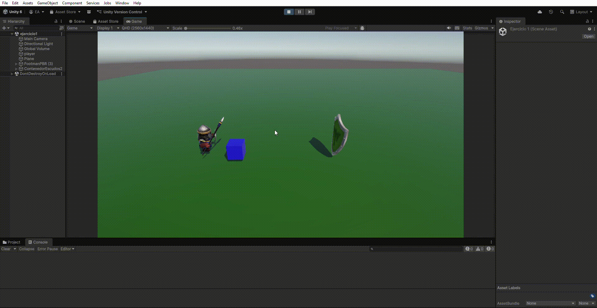
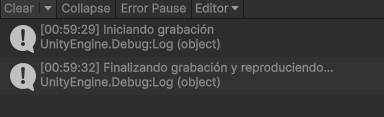
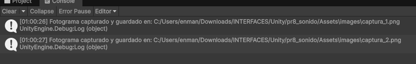
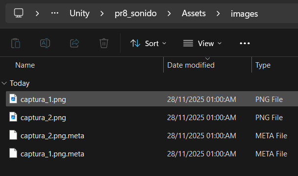

# Interfaces-Inteligentes - Micrófono y Cámara

- **Enmanuel Vegas Acosta** (alu0101281698)
- **Práctica 8**: Micrófono y Cámara

## **Ejercicios propuestos**

_1. Reproducir un sonido cuando los objetos se choquen._

Primeramente, debimos configurar todos los elementos de tipo`AudioSource` y su respectivo `AudioClip`. Aunque no se oiga en la imagen siguiente, el sonido se ejecuta en el momento en el que el soldado toca el escudo. Esto es posible gracias a [este script](./scripts/PlaySound.cs).

_2. Reproducir un sonido que es grabado al pulsar la tecla `R`._

[Este script](./scripts/Recorder.cs) permite grabar cuando el usuario pulse la tecla en cuestión.

_3. Captar fotogramas con la cámara._

[Este script](./scripts/Camera.cs) permite captar fotogramas obtenidos por la cámara del dispositivo y mostrarlos en la pantalla de la TV, como si fuese un vídeo.

_4. Mostrar nombre de la cámara en la consola._

_5. Capturar imágenes y almacenarlas de manera persistente._

[El script anterior](./scripts/Camera.cs) también se encarga de guardar las imagenes capturadas al pulsar la tecla `X`.

